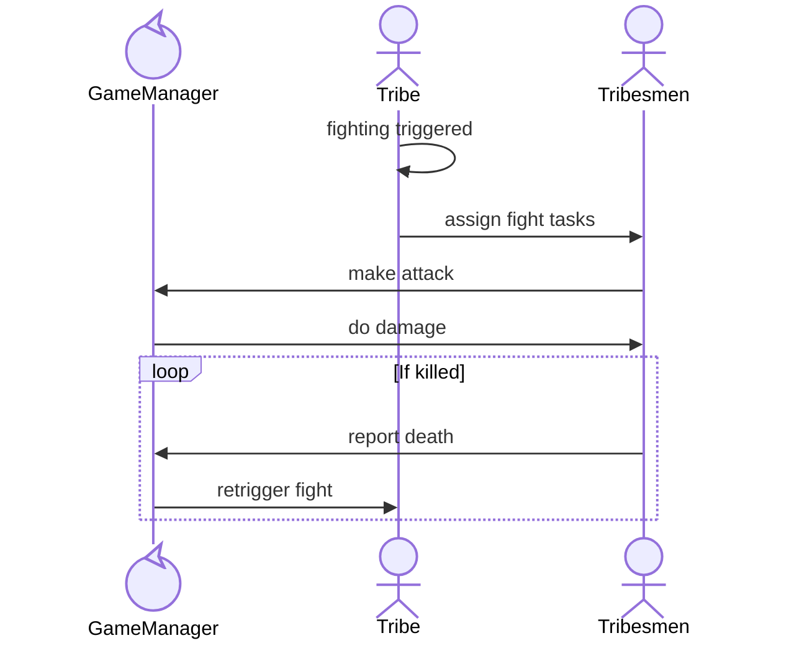

1. Tribes come in proximity
2. Freindlyness check
3. Tribe assigns fight tasks with targets to own tribesmen
4. Tribesmen do tasks, resulting in damage to other tribe's members
5. Every time a fighting task completes in gameLogic, we can call something like `tribes[tribesMan.tribeId].recalcFight()` to pick new matchups.
6. Repeat until one tribe is dead, or tribes leave each other alone (distance > INTERACTION_DISTANCE)

