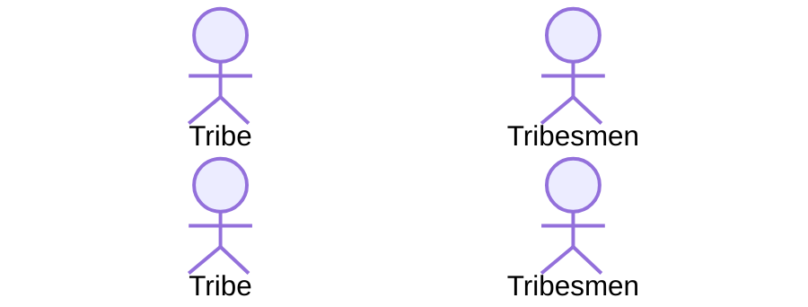

1. Tribes come in proximity
2. Freindlyness check
3. Tribe assigns fight tasks with targets to own tribesmen
4. Every time a fighting task completes in gameLogic, we can call something like `tribes[tribesMan.tribeId].recalcFight()` to pick new matchups.

