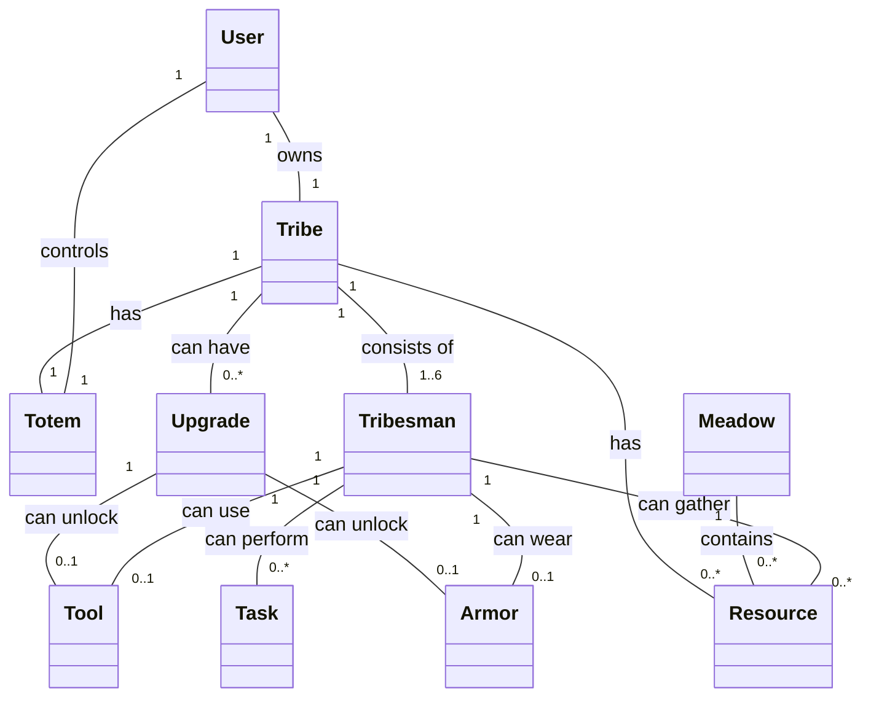

```mermaid
classDiagram

class User {}
class Tribe {}
class Totem {}
class Tribesman {}
class Upgrade {}
class Tool {}
class Resource {}
class Armor {}
class Task {}
class Meadow {}

User "1" -- "1" Tribe : owns
User "1" -- "1" Totem : controls
Tribe "1" -- "1" Totem : has
Tribe "1" -- "1..6" Tribesman : consists of
Tribe "1" -- "0..*" Upgrade : can have
Tribesman "1" -- "0..1" Tool : can use
Tribesman "1" -- "0..*" Resource : can gather
Tribesman "1" -- "0..1" Armor : can wear
Tribesman "1" -- "0..*" Task : can perform
Meadow "1" -- "0..*" Resource : contains
Tribe "1" -- "0..*" Resource : has
Upgrade "1" -- "0..1" Tool : can unlock
Upgrade "1" -- "0..1" Armor : can unlock
```