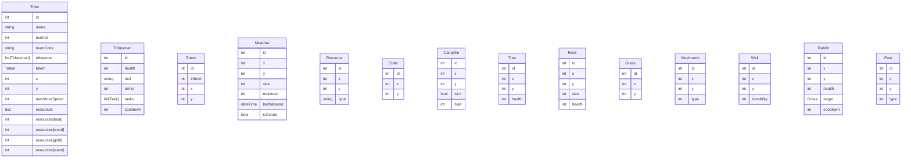

A description of each of the main entities in the game, as how I imagine they will be defined on the server. Probably going to make a base Entity class with id, x and y.

```mermaid
erDiagram

Tribe {
    int id
    string name
    int teamId
    string teamCode
    list[Tribesman] tribesmen
    Totem totem
    int x
    int y
    int maxMoveSpeed
    dict resources
    int resources[food]
    int resources[wood]
    int resources[gold]
    int resources[water]
}

Tribesman {
  int id
  int health
  string tool
  int armor
  list[Task] tasks
  int cooldown
}

Totem {
    int id
    int tribeId
    int x
    int y
}

Meadow {
    int id
    int x
    int y
    int size
    int moisture
    dateTime lastWatered
    bool isCenter
}

Resource {
    int id
    int x
    int y
    string type
}

Crate {
    int id
    int x
    int y
}

Campfire {
    int id
    int x
    int y
    bool isLit
    int fuel
}

Tree {
    int id
    int x
    int y
    int health
}

Rock {
    int id
    int x
    int y
    int size
    int health
}

Grass {
    int id
    int x
    int y
}

Mushroom {
    int id
    int x
    int y
    int type
}

Well {
    int id
    int x
    int y
    int durability
}

Rabbit {
    int id
    int x
    int y
    int health
    Grass target
    int cooldown
}

Post {
    int id
    int x
    int y
    int type
}

```