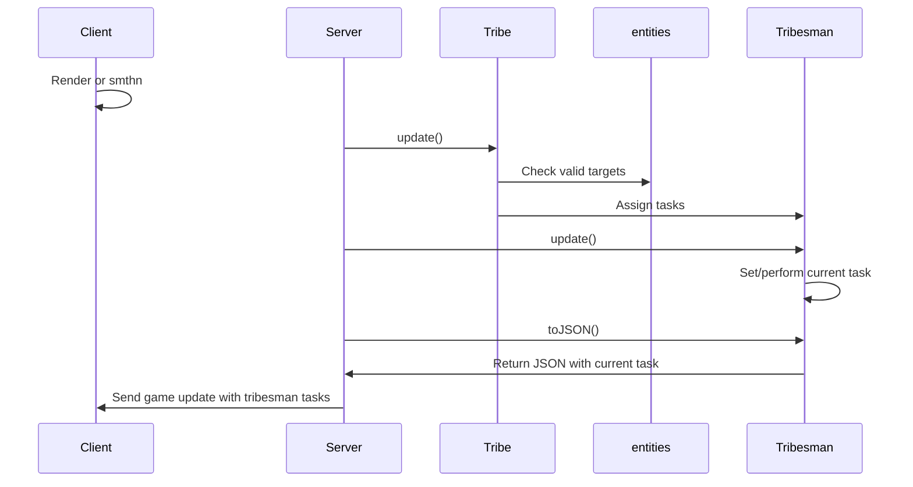

To add a new task:
1. Define the task in `shared/constants.js` with a name, priority, and cooldown time.
2. In `server/src/entities/tribe.js#update()`, add logic to check for the relevant entity and create a new task for it.
  2.1. Not all tasks (e.g. "pick mushroom") arise from proximity, so some will be added in other places like websocket handlers.
3. In `server/src/gameLogic.js#completeTask()`, add logic to handle the completion of *each step* of the task, such as giving resources to the tribesman or removing a rock from the map. Return true if all steps are complete (frees up the tribesman to move to a new task), false otherwise.

There are actually two different flavors of tasks: group tasks that can be done by multiple tribesmen at once (e.g. "chop tree"), and individual tasks that are assigned to a specific tribesman (e.g. "pickup resource"). I, however, in my infinite wisdom, decided to not differentiate between them in my task system. This will lead to no problems whatsoever good luck future me/contributors.