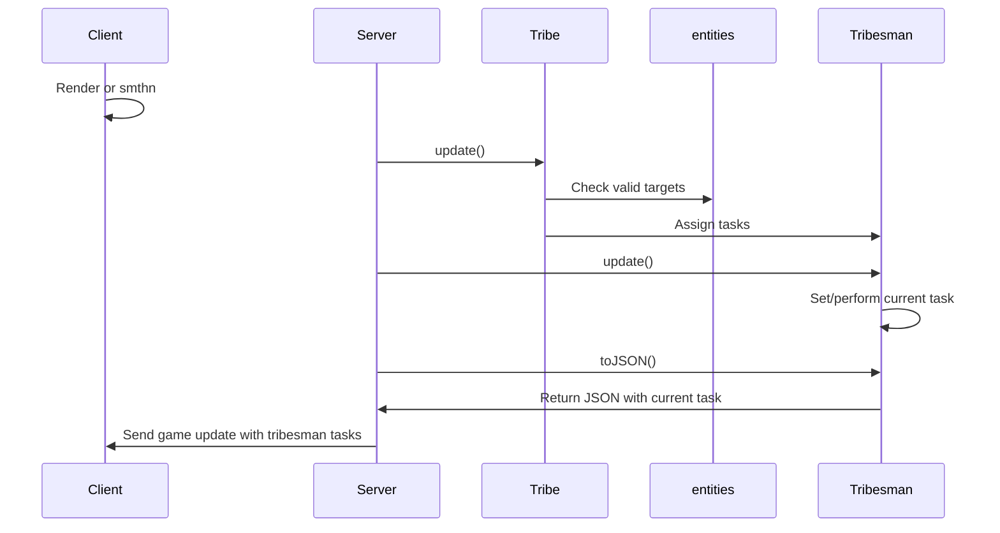

```mermaid
sequenceDiagram

Client->>Client: Render or smthn
Server->>Tribe: update()
Tribe->>entities: Check valid targets
Tribe->>Tribesman: Assign tasks
Server->>Tribesman: update()
Tribesman->>Tribesman: Set/perform current task
Server->>Tribesman: toJSON()
Tribesman->>Server: Return JSON with current task
Server->>Client: Send game update with tribesman tasks
```